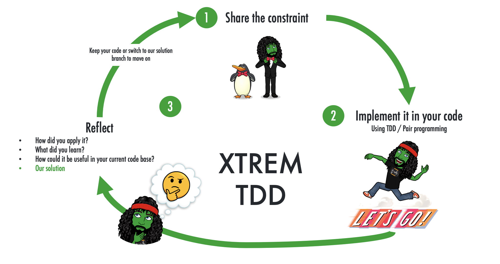
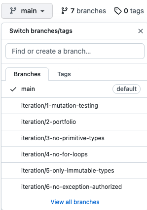

# Money Problem
This kata comes from [Saleem Siddiqui](https://www.linkedin.com/in/ssiddiqui/) 's book

[](https://www.oreilly.com/library/view/learning-test-driven-development/9781098106461/)

## What's the problem ?
We have  to build a spreadsheet to manage money in more than one currency : perhaps to manage a stock portfolio ?

| Stock | Stock exchange | Shares | Share Price | Total |
|---|---|---|---|---|
| IBM | NASDAQ | 100 | 124 USD | 12400 USD |
| BMW | DAX | 400 | 75 EUR | 30000 EUR |
| Samsung | KSE | 300 | 68000 KRW | 20400000 KRW |

To build it, we'd need to do simple arithmetic operations on numbers :

```text
5 USD x 2 = 10 USD
4002 KRW / 4 = 1000.5 KRW

// convert
5 USD + 10 EUR = 17 USD
1 USD + 1100 KRW = 2200 KRW
```

* We can use this table to determine exchange rates :

| From | To   | Rate    |
|------|------|---------|
| EUR  | USD  | 1.2     |
| USD  | EUR  | 0.82    |
| USD  | KRW  | 1100    |
| KRW  | EUR  | 0.0009  |
| EUR  | KRW  | 1344    |
| KRW  | EUR  | 0.00073 |

## List of Features to implement
We have already started the implementation by using TDD. We have discovered examples that helped us drive our implementation.

```text
Money Calculator :
✅ 10 EUR x 2 = 20 EUR
✅ 4002 KRW / 4 = 1000.5 KRW
✅ 5 USD + 10 USD = 15 USD

Bank implementation :
✅ Determine exchange rate based on the currencies involved (from -> to)
✅ Improve the implementation of exchange rates
✅ Allow exchange rates to be modified
```

A few of them are not developed yet, it will be your mission during this kata :

- [ ] 5 USD + 10 EUR = 17 USD
- [ ] 1 USD + 1100 KRW = 2200 KRW

## Constraints
You will have to develop using the main constraints:

- Test-Driven Development
- Pair Programming

### Xtrem iteration
We will work in small iterations (20')



- Share the constraint - 1'
- Implement it in your code - 14'
- Debriefing - 5'
	- How did you apply it?
	- What did you learn?
	- How could it be useful in your current code base?
	- Our solution
		- Keep your code or switch to our solution branch to move on

### Workshop constraints
In this workshop, we will make those iterations:

- Let's mutate the production code
	- Run code coverage
   - [Mutation Testing](https://xtrem-tdd.netlify.app/Flavours/mutation-testing)
- Implement missing features using TDD
   - [Generate Code From Usage](https://xtrem-tdd.netlify.app/Flavours/generate-code-from-usage)
- Stop [Primitive obsession](https://refactoring.guru/fr/smells/primitive-obsession)
   - No Primitive Types
- No for loops
- No more state mutation
   - [Only immutable types](https://xtrem-tdd.netlify.app/Flavours/immutable-types)
- [No exception authorized](https://xtrem-tdd.netlify.app/Flavours/avoid-exceptions)

### Solution
We have created 1 branch per constraint



Each branch contains:
- a possible `solution` for the given constraint in `java` and `c#`
- a `step-by-step` guide to reproduce how we came from previous state to the state in the branch
  - 1 guide per language in `<language>/docs/<#iteration>.<constraint>.md`
