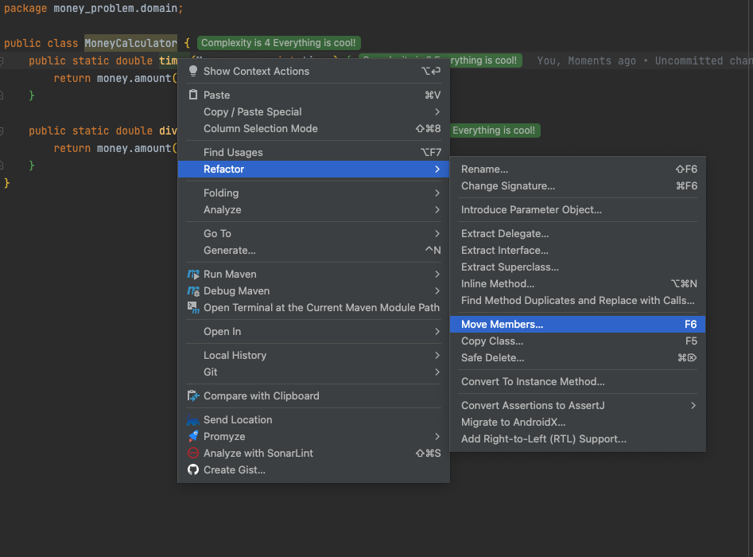

# No Primitive Types
## Introduce Money concept
- A concept emerge from the code 
  - A `Money` concept which is not cohesive with behavior in the `MoneyCalculator` 
```java
public class MoneyCalculator {
    public static double times(double amount, Currency currency, int times) { ... }
    public static double divide(double amount, Currency currency, int divisor) { ... }
}

public class Portfolio {
    public void add(double amount, Currency currency) { ... }
    ...
}
```

- Introduce Parameter Object from `MoneyCalculator`
  - You can use `Introduce Parameter Object` from your IDE


- Refactoring result :

```java
public class MoneyCalculator {
    public static double times(Money money, int times) {
        return money.amount() * times;
    }

    public static double divide(double amount, Currency currency, int divisor) {
        return amount / divisor;
    }
}

public record Money(double amount, Currency currency) { }

@Test
@DisplayName("10 EUR x 2 = 20 EUR")
void shouldMultiplyInEuros() {
    assertThat(MoneyCalculator.times(new Money(10, EUR), 2))
            .isEqualTo(20);
}
```

- Let's adapt the `divide` as well

```java
public class MoneyCalculator {
    public static double times(Money money, int times) {
        return money.amount() * times;
    }

    public static double divide(Money money, int divisor) {
        return money.amount() / divisor;
    }
}

@Test
@DisplayName("4002 KRW / 4 = 1000.5 KRW")
void shouldDivideInKoreanWons() {
    assertThat(MoneyCalculator.divide(new Money(4002, KRW), 4))
            .isEqualTo(1000.5);
}
```

- Now that we have a dedicated concept for our money operations we can move methods from `MoneyCalculator` to `Money`
  - We can use `Move Members` feature from our IDE



- Then configure the refactoring `move to` and `members`


- Here is this step result
```java
public record Money(double amount, Currency currency) {
    public static double times(Money money, int times) {
        return money.amount() * times;
    }

    public static double divide(Money money, int divisor) {
        return money.amount() / divisor;
    }
}

class MoneyCalculatorTest {
    @Test
    @DisplayName("10 EUR x 2 = 20 EUR")
    void shouldMultiplyInEuros() {
        assertThat(Money.times(new Money(10, EUR), 2))
                .isEqualTo(20);
    }

    @Test
    @DisplayName("4002 KRW / 4 = 1000.5 KRW")
    void shouldDivideInKoreanWons() {
        assertThat(Money.divide(new Money(4002, KRW), 4))
                .isEqualTo(1000.5);
    }
}

public class MoneyCalculator { }
```

## Clean our code
- We can now make some cleanup
    - Delete `MoneyCalculator`
    - Rename `MoneyCalculatorTest` to `MoneyTest`
    - Make methods non static in `Money`
      - Adapt the tests as well

```java
public record Money(double amount, Currency currency) {
    public double times(int times) {
        return amount * times;
    }

    public double divide(int divisor) {
        return amount / divisor;
    }
}

class MoneyTest {
    @Test
    @DisplayName("10 EUR x 2 = 20 EUR")
    void shouldMultiplyInEuros() {
        assertThat(new Money(10, EUR).times(2))
                .isEqualTo(20);
    }

    @Test
    @DisplayName("4002 KRW / 4 = 1000.5 KRW")
    void shouldDivideInKoreanWons() {
        assertThat(new Money(4002, KRW).divide(4))
                .isEqualTo(1000.5);
    }
}
```

## Adapt the Portfolio
Now that we have introduced our `Money` concept let's enrich our `Portfolio` as well :
- Adapt an existing test
- Generate a new `add` method from the test taking `Money` as parameter

```java
@Test
@DisplayName("5 USD + 10 USD = 15 USD")
void shouldAddMoneyInTheSameCurrency() throws MissingExchangeRatesException {
    var portfolio = new Portfolio();
    portfolio.add(new Money(5, USD));
    portfolio.add(new Money(10, USD));

    assertThat(portfolio.evaluate(bank, USD))
            .isEqualTo(15);
}
```

- Our test is now red
  - Let's make it green by plug-in the new `add` method to the existing one

```java
public class Portfolio {
    private final Map<Currency, List<Double>> moneys = new EnumMap<>(Currency.class);

    public void add(double amount, Currency currency) {
        moneys.compute(currency, (c, amounts) -> {
            if (amounts == null) {
                amounts = new ArrayList<>();
            }
            amounts.add(amount);
            return amounts;
        });
    }

    public void add(Money money) {
        this.add(money.amount(), money.currency());
    }

    public double evaluate(Bank bank, Currency toCurrency) throws MissingExchangeRatesException {
        ...
    }
}
```

- Our test is now green -> let's refactor our code
  - Change the `add(Money money)` to add `Money` to a private List
  - Plug the existing `add` method to the new one
  - Change the loop from the `evaluate` method to use the `moneys` List

```java
public class Portfolio {
    private final ArrayList<Money> moneys = new ArrayList<>();

    public void add(double amount, Currency currency) {
        add(new Money(amount, currency));
    }

    public void add(Money money) {
        moneys.add(money);
    }

    public double evaluate(Bank bank, Currency toCurrency) throws MissingExchangeRatesException {
        var convertedResult = 0d;
        var missingExchangeRates = new ArrayList<MissingExchangeRateException>();

        for (Money money : moneys) {
            try {
                var convertedAmount = bank.convert(money.amount(), money.currency(), toCurrency);
                convertedResult += convertedAmount;
            } catch (MissingExchangeRateException missingExchangeRateException) {
                missingExchangeRates.add(missingExchangeRateException);
            }
        }

        if (!missingExchangeRates.isEmpty()) {
            throw new MissingExchangeRatesException(missingExchangeRates);
        }
        return convertedResult;
    }
}
```

- From our refactoring, we have "discovered" that we need to adapt our `Bank` as well to handle `Money` 
