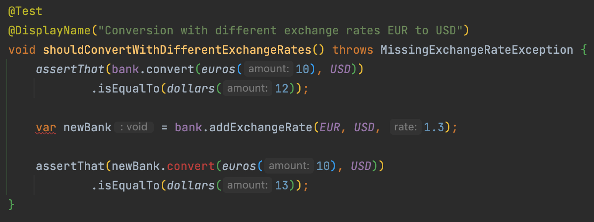
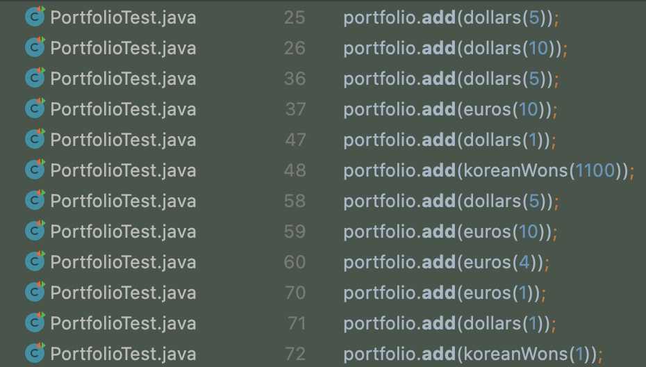
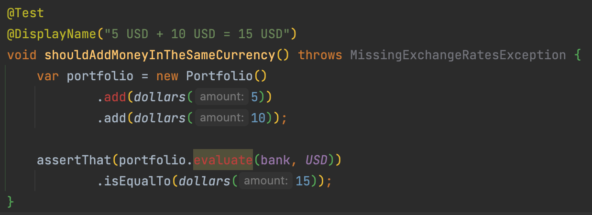

# Only Immutable Types
- Let's identify mutable types
  - Find where we have mutations in our classes

```java
public final class Bank {
    ...
    
    public void addExchangeRate(Currency from, Currency to, double rate) {
        exchangeRates.put(keyFor(from, to), rate);
    }

    ...
}

public final class Portfolio {
    ...
    public void add(Money money) {
        moneys.add(money);
    }
    ...
}
```

## Bank
- We start by the `Bank` implementation
  - What we want to achieve by making it immutable is to have a method `addExchangeRate` with a signature like this `Currency` -> `Currency` -> `double` -> `Bank`
  - Let's start by adapting a test to make it `red`
    - We don't compile



- Make it `green`
```java
public Bank addExchangeRate(Currency from, Currency to, double rate) {
    var updateExchangeRates = exchangeRates;
    updateExchangeRates.put(keyFor(from, to), rate);

    return new Bank(updateExchangeRates);
}
```
- Now we can refactor
  - Let's simplify our test
```java
@Test
@DisplayName("Conversion with different exchange rates EUR to USD")
void shouldConvertWithDifferentExchangeRates() throws MissingExchangeRateException {
    assertThat(bank.convert(euros(10), USD))
            .isEqualTo(dollars(12));

    assertThat(bank.addExchangeRate(EUR, USD, 1.3)
            .convert(euros(10), USD))
            .isEqualTo(dollars(13));
}
```
- Let's make it impossible to mutate accidentally our `exchangeRates` from the `Bank`
  - We can force it by using `Collections.unmodifiableMap` from the private constructor
```java
public final class Bank {
    private final Map<String, Double> exchangeRates;

    private Bank(Map<String, Double> exchangeRates) {
        this.exchangeRates = Collections.unmodifiableMap(exchangeRates);
    }
    
    public static Bank withExchangeRate(Currency from, Currency to, double rate) {
        var bank = new Bank(new HashMap<>());
        return bank.addExchangeRate(from, to, rate);
    }
    
    ...

    public Bank addExchangeRate(Currency from, Currency to, double rate) {
        var updateExchangeRates = new HashMap<>(exchangeRates);
        updateExchangeRates.put(keyFor(from, to), rate);

        return new Bank(updateExchangeRates);
    }
}
```

- We had an impact on `Portflio` tests by doing it and need to adapt the test code as well
  - Now that `Bank` is immutable we need to change the private field instantiation
```java
class PortfolioTest {
    private Bank bank;

    @BeforeEach
    void setup() {
        bank = Bank.withExchangeRate(EUR, USD, 1.2)
                .addExchangeRate(USD, KRW, 1100);
    }
    ...
}
```

## Portfolio
- Regarding the `add` method, it is used a lot of time, so we need to have a different refactoring strategy



- Let's use the [Wrap Technique](https://understandlegacycode.com/blog/key-points-of-working-effectively-with-legacy-code/#2-the-wrap-technique) like we did already


- Rename the existing method to `addOld`
```java
public void addOld(Money money) {
    moneys.add(money);
}
```

- Adapt a test to have a red test that will call the new method



- Generate the new `add` method from test
  - Call the old method from the new one
  
```java
public Portfolio add(Money money) {
    this.addOld(money);
    return this;
}
```

- Now we can refactor
  - We add a private constructor
  - And need to define a public one as well

```java
public final class Portfolio {
    private final List<Money> moneys;

    public Portfolio() {
        this.moneys = new ArrayList<>();
    }

    private Portfolio(List<Money> moneys) {
        this.moneys = Collections.unmodifiableList(moneys);
    }

    public void addOld(Money money) {
        moneys.add(money);
    }

    public Portfolio add(Money money) {
        var updatedMoneys = new ArrayList<>(moneys);
        updatedMoneys.add(money);

        return new Portfolio(updatedMoneys);
    }
    ...
}
```

- Now out test is green
- Let's refactor our test to make it simple to instantiate `Portfolio`
  - We encapsulate `Portfolio` instantiation in a dedicated method taking n Moneys as args

```java
@Test
@DisplayName("5 USD + 10 USD = 15 USD")
void shouldAddMoneyInTheSameCurrency() throws MissingExchangeRatesException {
    var portfolio = portfolioWith(
            dollars(5),
            dollars(10)
    );

    assertThat(portfolio.evaluate(bank, USD))
            .isEqualTo(dollars(15));
}

private Portfolio portfolioWith(Money... moneys) {
    return Arrays.stream(moneys)
            .reduce(new Portfolio(), Portfolio::add, (previousPortfolio, newPortfolio) -> newPortfolio);
}
```

- Let's plug remaining tests to the new `add` method

````java
@Test
@DisplayName("5 USD + 10 EUR = 17 USD")
void shouldAddMoneyInDollarsAndEuros() throws MissingExchangeRatesException {
    var portfolio = portfolioWith(
            dollars(5),
            euros(10)
    );

    assertThat(portfolio.evaluate(bank, USD))
            .isEqualTo(dollars(17));
}

@Test
@DisplayName("1 USD + 1100 KRW = 2200 KRW")
void shouldAddMoneyInDollarsAndKoreanWons() throws MissingExchangeRatesException {
    var portfolio = portfolioWith(
            dollars(1),
            koreanWons(1100)
    );

    assertThat(portfolio.evaluate(bank, KRW))
            .isEqualTo(koreanWons(2200));
}

@Test
@DisplayName("5 USD + 10 EUR + 4 EUR = 21.8 USD")
void shouldAddMoneyInDollarsAndMultipleAmountInEuros() throws MissingExchangeRatesException {
    var portfolio = portfolioWith(
            dollars(5),
            euros(10),
            euros(4)
    );

    assertThat(portfolio.evaluate(bank, USD))
            .isEqualTo(dollars(21.8));
}

@Test
@DisplayName("Throws a MissingExchangeRatesException in case of missing exchange rates")
void shouldThrowAMissingExchangeRatesException() {
    var portfolio = portfolioWith(
            euros(1),
            dollars(1),
            koreanWons(1)
    );

    assertThatThrownBy(() -> portfolio.evaluate(bank, EUR))
            .isInstanceOf(MissingExchangeRatesException.class)
            .hasMessage("Missing exchange rate(s): [USD->EUR],[KRW->EUR]");
}
````

- We can safely delete the `addOld` method

